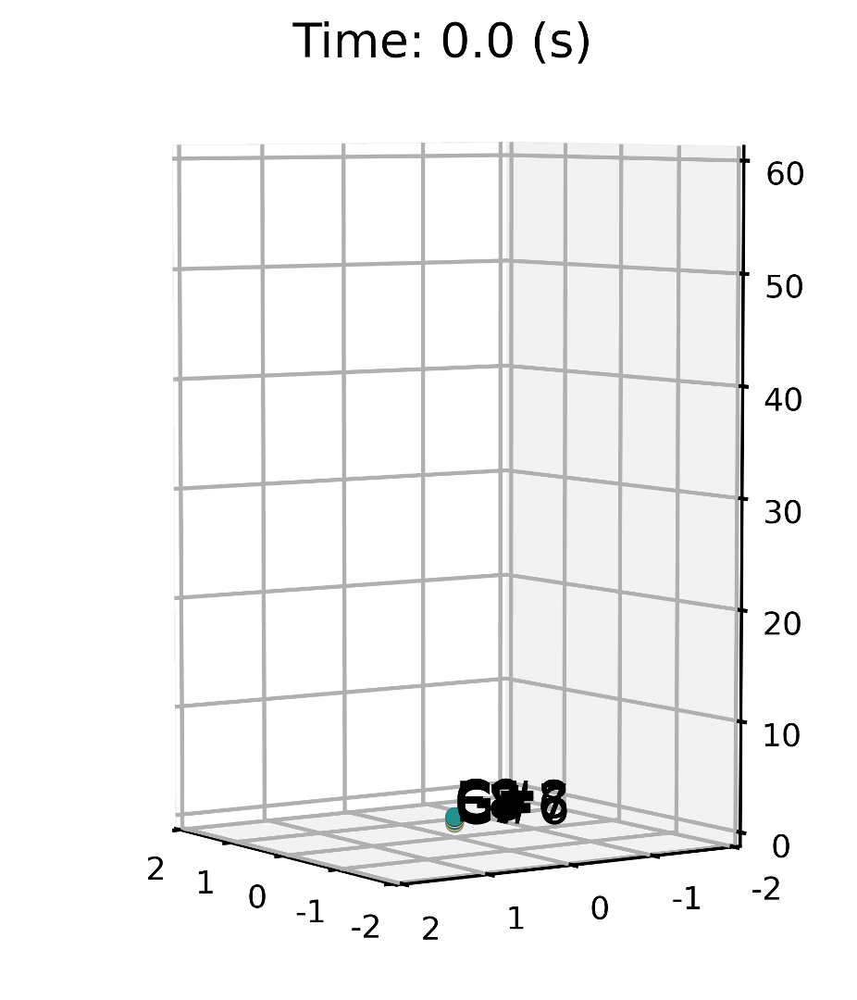
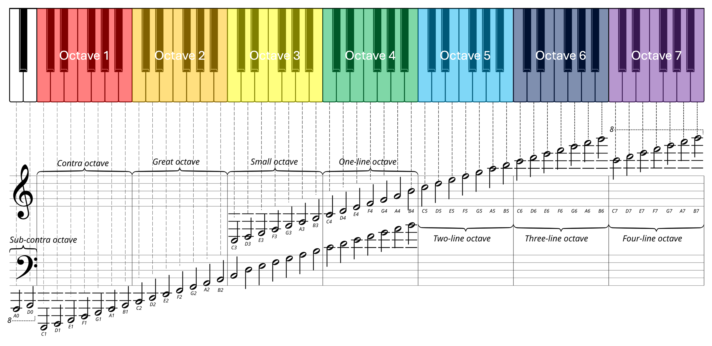

# Decode Pitch MEG

This repo contains the Python script of my paper: 

- Chang, A., Poeppel, D., & Teng, X. (2025). Temporally dissociable neural representations of pitch height and chroma. *Journal of Neuroscience*, 45 (8) e1567242024 [Links to [paper](https://doi.org/10.1523/JNEUROSCI.1567-24.2024) and [preprint](https://doi.org/10.31234/osf.io/cnh5w)]

### My machine learning model reconstructs how the brain dynamically represents musical pitches. Pitches that are closer together in space are represented as more similar in the brain at that moment. ####



## What is that?
In this study, I used a machine learning model to "decode" how the brain represents musical pitches while a person listens to them during a magnetoencephalography (MEG) scan (essentially a form of "mind-reading"). The model not only identified the pitch being heard but also reconstructed how the brain represents the similarity between different pitches and how this representation changes over time.

Interestingly, the brain usually represents pitches in a mostly linear structure, similar to the layout of a piano keyboard from left to right. However, about 0.3 seconds after hearing a sound, the brain briefly represents the sound in a helix-like structure. This helix reflects the concept of octave equivalence—the idea that pitches separated by an octave (e.g., the repeating white and black keys on a piano) are perceived as inherently similar.



## Data  

The processed data (the folders `pyenv`, `save_fif`, and `sourceSTC20230711_ico3_freqBands_shuffled`) can be downloaded from the [OSF project page](https://osf.io/nhcgj/).  

To retrieve the data, download all three files: `processed_data_part_aa`, `processed_data_part_ab`, and `processed_data_part_ac`. Once downloaded, run the following command to concatenate them into a single ZIP file:  

```bash
cat processed_data_part* > processed_data.zip
```

## License

This work is licensed under a [Creative Commons Attribution-ShareAlike 4.0 International License](https://creativecommons.org/licenses/by-sa/4.0/).

[](https://creativecommons.org/licenses/by-sa/4.0/)
